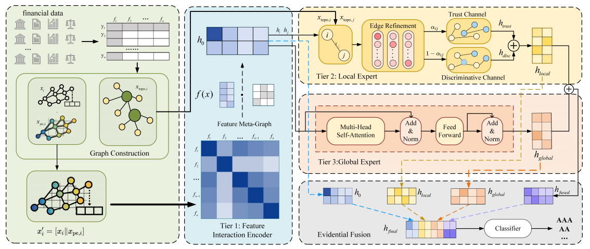

# SARE-GT: Structure-Aware Robust Enhancement Graph Transformer for Corporate Credit Rating

Official implementation of the paper:

> **SARE-GT: Structure-Aware Robust Enhancement Graph Transformer for Corporate Credit Rating**
>
> Liangyu Kong, Zhongliang Yang\*, Yisi Wang, and Linna Zhou\*
>
> *IJCNN 2026*

---

## Overview

Corporate credit rating is fundamentally an ordinal classification task, yet existing GNN-based methods largely ignore this structure and rely on metrics insensitive to ordinal violations. **SARE-GT** achieves intrinsic architectural robustness through hierarchical evidence fusion across three tiers:

| Tier | Name | Mechanism |
|------|------|-----------|
| **1** | Intra-Feature Systemics | Learnable meta-graph convolution over financial indicators |
| **2** | Local Expert | Topology-aware dual-channel GAT with trust / discriminative aggregation |
| **3** | Global Expert | Multi-layer Graph Transformer for market-wide risk transmission |
| **Fusion** | ExpertGate | Adaptive per-node gating that balances local and global evidence |

<p align="center">
  
</p>


## Key Contributions

- **Metric Realignment** – We advocate Quadratic Weighted Kappa (QWK) as the primary metric for ordinal credit-rating evaluation.
- **Intrinsic Robustness** – Multi-view cross-verification of local and global structural evidence, without explicit noise estimation.
- **Hierarchical Fusion** – Three-tier evidence fusion architecture with adaptive ExpertGate.
- **Empirical Validation** – SARE-GT significantly outperforms SOTA baselines, achieving **QWK = 0.9694**.

## Project Structure

```
SARE-GT-IJCNN2026/
├── model.py            # SARE-GT architecture (Tiers 1–3 + ExpertGate)
├── dataset.py          # Latent Peer Network construction (k-NN + LapPE)
├── topology.py         # Topological feature computation
├── train.py            # Training script (entry point)
├── utils.py            # Logging, LR scheduler, metrics
├── requirements.txt    # Python dependencies
└── README.md
```

## Requirements

- Python 3.9+
- PyTorch ≥ 2.0
- PyTorch Geometric ≥ 2.4
- CUDA 11.8+ (tested on RTX 3070 Ti)

Install dependencies:

```bash
# 1. Create conda environment
conda create -n sare-gt python=3.9 -y
conda activate sare-gt

# 2. Install PyTorch (adjust CUDA version as needed)
pip install torch torchvision torchaudio --index-url https://download.pytorch.org/whl/cu124

# 3. Install PyG
pip install torch-geometric

# 4. Install remaining dependencies
pip install -r requirements.txt
```

## Dataset

We use a public Chinese corporate credit dataset (CSMAR/WIND, 2005–2023) comprising >200,000 records across nine rating levels (AAA–C), split 70/15/15 for train/validation/test.

Place your preprocessed data file at:

```
CCRDataset/raw/data.npz
```

The `data.npz` file should contain:
- `train_x`: Training features `[N_train, 39]`
- `test_x`: Test features `[N_test, 39]`
- `train_y`: Training labels `[N_train]`
- `test_y`: Test labels `[N_test]`

## Training

```bash
python train.py \
    --data_root ./CCRDataset \
    --epochs 600 \
    --hidden_dim 256 \
    --num_layers 3 \
    --transformer_layers 2 \
    --k_neighbors 15 \
    --lr 0.002 \
    --seed 42
```

### Key Hyperparameters

| Parameter | Default | Description |
|-----------|---------|-------------|
| `--hidden_dim` | 256 | Hidden feature dimension |
| `--num_layers` | 3 | Number of GAT layers in Local Expert |
| `--transformer_layers` | 2 | Number of Graph Transformer layers |
| `--k_neighbors` | 15 | k for k-NN graph construction |
| `--pe_dim` | 16 | Laplacian PE dimension |
| `--epochs` | 600 | Training epochs |
| `--lr` | 0.002 | Base learning rate |

## Results

Performance comparison on the test set (best results in **bold**):

| Model | Accuracy (%) | F1-Macro (%) | QWK |
|-------|:---:|:---:|:---:|
| CCR-GNN | 93.25 | 88.74 | 0.9388 |
| HHGNN | 87.98 | 68.33 | 0.9287 |
| GDAN | 94.12 | 92.63 | 0.9475 |
| CoReGraph-CR | 91.64 | 71.71 | 0.9410 |
| **SARE-GT (Ours)** | **95.15** | **95.05** | **0.9694** |

## Citation

If you find this code useful, please cite our paper:

```bibtex
@inproceedings{kong2026saregt,
  title     = {{SARE-GT}: Structure-Aware Robust Enhancement Graph Transformer
               for Corporate Credit Rating},
  author    = {Kong, Liangyu and Yang, Zhongliang and Wang, Yisi and Zhou, Linna},
  booktitle = {Proceedings of the International Joint Conference on Neural Networks (IJCNN)},
  year      = {2026}
}
```

## Acknowledgements

This work was supported in part by the National Key Research and Development Program of China under Grant 2023YFC3305401 and in part by the National Natural Science Foundation of China under Grant 62172053 and Grant 62302059.

## License

This project is released for academic research purposes. Please refer to the [LICENSE](LICENSE) file for details.
